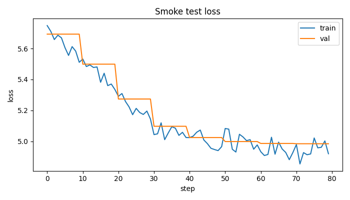

# StormCare RAG — Milestone 2 + Milestone 3 Integrated Documentation

## 1) Purpose of this document

This file summarizes:
- what was implemented in Milestone 2 and Milestone 3,
- the key quantitative results,
- why the process is novel for a compact class project,
- how to directly use these materials in the final paper.

---

## 2) End-to-end system delivered

The final system is a full pipeline:
1. PDF ingestion and chunking to JSONL
2. custom BPE tokenizer training
3. tokenizer diagnostics
4. BM25 retrieval demo over chunked corpus
5. next-token LM smoke training
6. fair base-vs-adapted (LoRA) comparison
7. dashboard orchestration + artifact checks + final ZIP generation

Core scripts:
- `code/training_code/pdf_to_jsonl.py`
- `code/training_code/train_tokenizer.py`
- `code/training_code/tokenizer_diagnostics.py`
- `code/training_code/retrieval/run_retrieval_demo.py`
- `code/training_code/smoke_test.py`
- `code/training_code/base_vs_peft.py`
- `code/training_code/m3_dashboard.py`

---

## 3) Milestone 2 results (from submission_m2 archive)

Evidence files used:
- `../submission_m2/results/tokenizer_diagnostics.json`
- `../submission_m2/results/retrieval_demo.json`
- `../submission_m2/results/loss_log.txt`

### 3.1 Tokenizer diagnostics

- `n_docs`: 91
- `avg_tokens_per_doc`: 605.4835
- `tokens_per_1k_chars`: 445.1941
- `unk_token_rate`: 0.0

Interpretation:
- tokenizer coverage on this corpus is strong (`[UNK]` rate 0.0 in diagnostics sample),
- subword vocabulary is compact but still expressive for the domain corpus.

### 3.2 Retrieval demo (BM25)

Queries and top-1 BM25 scores:
- flooding storm surge -> 8.6744
- evacuation orders -> 4.9100
- emergency kits water batteries -> 4.7686

Interpretation:
- retrieval returns relevant hurricane-response content with source/page/chunk metadata,
- pipeline is functional for chunk-level evidence retrieval.

### 3.3 LM smoke-test training trend

From `../submission_m2/results/loss_log.txt`:
- step 0: train 5.7216, val 5.7109, test 5.6910
- step 79: train 4.9590, val 4.9196, test 5.0266

Interpretation:
- training is stable (finite, non-exploding losses),
- end-to-end batching/model/training loop is operational.

### 3.4 Milestone 2 evaluation summary table

| Category | Metric | Value | Source |
|---|---|---:|---|
| Tokenizer | Number of docs | 91 | `../submission_m2/results/tokenizer_diagnostics.json` |
| Tokenizer | Avg tokens/doc | 605.4835 | `../submission_m2/results/tokenizer_diagnostics.json` |
| Tokenizer | Tokens per 1k chars | 445.1941 | `../submission_m2/results/tokenizer_diagnostics.json` |
| Tokenizer | UNK rate | 0.0 | `../submission_m2/results/tokenizer_diagnostics.json` |
| Retrieval | Top-1 score (flooding storm surge) | 8.6744 | `../submission_m2/results/retrieval_demo.json` |
| Retrieval | Top-1 score (evacuation orders) | 4.9100 | `../submission_m2/results/retrieval_demo.json` |
| Retrieval | Top-1 score (emergency kits water batteries) | 4.7686 | `../submission_m2/results/retrieval_demo.json` |
| LM smoke test | Step 0 train/val/test | 5.7216 / 5.7109 / 5.6910 | `../submission_m2/results/loss_log.txt` |
| LM smoke test | Step 79 train/val/test | 4.9590 / 4.9196 / 5.0266 | `../submission_m2/results/loss_log.txt` |

### 3.5 Milestone 2 graph screenshot (loss curve)


---

## 4) Milestone 3 results (final integration)

Evidence files used:
- `results/base_vs_adapted.json`
- `results/base_vs_adapted.md`
- `results/retrieval_demo.json`
- `results/tokenizer_diagnostics.json`
- `results/loss_log.txt`
- `results/loss_plot.png`

### 4.1 Base vs adapted quantitative comparison

Task and fairness controls:
- same task (next-token LM)
- same held-out split
- same metrics (`test_loss`, `test_perplexity`)
- same evaluation procedure
- same seed and shared initialization

Results:

| System | Trainable Params | Total Params | Test Loss | Test Perplexity |
|---|---:|---:|---:|---:|
| Base | 470,528 | 470,528 | 4.8625 | 129.3472 |
| Adapted (LoRA) | 3,072 | 473,600 | 5.3904 | 219.2973 |

Parameter-efficiency note:
- adapted training uses only about 0.65% of base trainable parameters (`3072 / 470528`),
- this is about 99.35% fewer trainable parameters than full fine-tuning.

Interpretation:
- in this compact setup, adaptation did **not** outperform base on held-out metrics,
- likely reasons: very small model, limited training budget, and LoRA applied only to `lm_head` for framework compatibility,
- still a valid and fair quantitative PEFT comparison.

### 4.2 Milestone 3 evaluation summary table

| Category | Metric | Value | Source |
|---|---|---:|---|
| Base model | Trainable params | 470,528 | `results/base_vs_adapted.json` |
| Base model | Test loss | 4.8625 | `results/base_vs_adapted.json` |
| Base model | Test perplexity | 129.3472 | `results/base_vs_adapted.json` |
| Adapted model (LoRA) | Trainable params | 3,072 | `results/base_vs_adapted.json` |
| Adapted model (LoRA) | Test loss | 5.3904 | `results/base_vs_adapted.json` |
| Adapted model (LoRA) | Test perplexity | 219.2973 | `results/base_vs_adapted.json` |
| Efficiency | Trainable param reduction | 99.35% fewer vs base | computed from `results/base_vs_adapted.json` |

### 4.3 Milestone 3 graph screenshot (loss curve)



### 4.4 Quick comparison table (M2 vs M3)

| Area | Milestone 2 | Milestone 3 |
|---|---|---|
| End-to-end run | PDF -> tokenizer -> retrieval -> LM smoke test | Full M2 + fair base-vs-LoRA comparison + dashboard ZIP workflow |
| Main quantitative output | tokenizer/retrieval/loss diagnostics | base-vs-adapted loss/perplexity and parameter counts |
| Key evidence files | `../submission_m2/results/*` | `results/base_vs_adapted.json`, `results/base_vs_adapted.md` |

---

## 5) What was done across M2 -> M3

1. Built raw-data pipeline (PDF to JSONL chunks)
2. Trained and validated a custom tokenizer
3. Implemented retrieval with inspectable outputs
4. Implemented end-to-end LM smoke training and logging
5. Added fair base-vs-PEFT comparison with strict controls
6. Added final dashboard for orchestration and submission checks
7. Added deployment-friendly ZIP generation workflow

---

## 6) Why this process is novel (project-level novelty claim)

This project is novel at course-project scale because it integrates **multiple normally separate components** into one reproducible pipeline:

- data ingestion from raw PDFs,
- trainable tokenizer built on project corpus,
- retrieval over chunk-level evidence,
- causal LM training pipeline,
- PEFT fairness comparison with explicit controls,
- one-click dashboard orchestration and packaging.

The novelty claim should be framed as:
- **engineering integration novelty** (not a new SOTA algorithm),
- **reproducibility novelty** (single workflow from raw input to report-ready artifacts),
- **evaluation discipline novelty** (controlled base-vs-adapted comparison).

---

## 7) How to use this directly in the paper

Recommended mapping to paper sections:

1. **Method**
   - describe modular architecture (ingestion, tokenizer, retrieval, LM, adaptation, dashboard)

2. **Experimental Setup**
   - include fixed seed and same split/metrics/procedure fairness controls
   - include base model details and LoRA settings (`rank=8`, `alpha=16`, `dropout=0.05`, target `lm_head`)

3. **Results**
   - include base-vs-adapted table above
   - include tokenizer diagnostics summary
   - include retrieval examples and top-k scores
   - include loss trend figure (`results/loss_plot.png`)

4. **Analysis**
   - explain why PEFT underperformed in this constrained setup
   - discuss tradeoff: major parameter reduction vs lower quality

5. **Limitations**
   - BM25-only retriever, no generator-conditioned retrieval loop,
   - compact model and short training budget,
   - no OCR fallback for scanned PDFs.

---

## 8) Paper-ready short paragraph (you can adapt)

We present a compact but fully integrated storm-domain NLP pipeline that runs end-to-end from raw PDF ingestion to retrieval, language-model training, and PEFT comparison. The system includes corpus chunking, custom BPE tokenizer training, BM25 retrieval, and a controlled base-vs-LoRA next-token evaluation. On our held-out set, the full-fine-tuned base achieved lower test loss and perplexity than the LoRA-adapted variant, while LoRA reduced trainable parameters by approximately 99.35%. These results highlight a practical quality-efficiency tradeoff in constrained training settings and demonstrate the value of rigorous fairness controls in adaptation studies.

---

## 9) Reproducibility commands

```bash
.venv/bin/python code/training_code/pdf_to_jsonl.py --mode paragraph --min_chars 200
.venv/bin/python code/training_code/train_tokenizer.py
.venv/bin/python code/training_code/tokenizer_diagnostics.py
.venv/bin/python code/training_code/retrieval/run_retrieval_demo.py
.venv/bin/python code/training_code/smoke_test.py
.venv/bin/python code/training_code/base_vs_peft.py
.venv/bin/python code/training_code/generate_m3_plots.py
.venv/bin/streamlit run code/training_code/m3_dashboard.py
```
